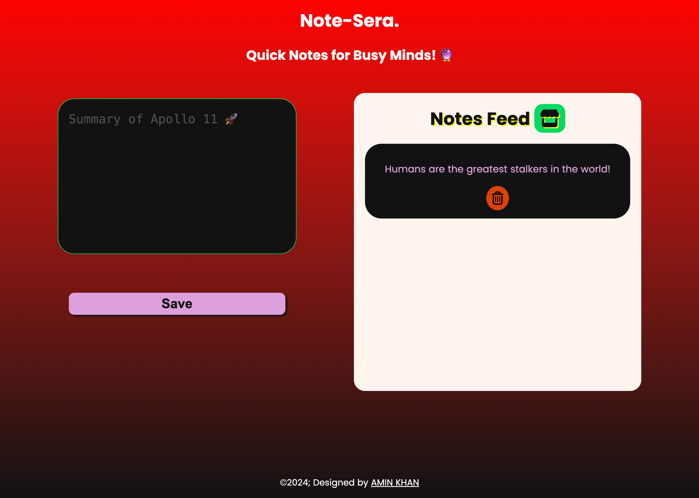

# Note-Sera

### Mini Notes, Never Forget Anything Again! 🧠



Note-Sera is a simple web app to help you jot down notes quickly and remember them with ease. Designed with a sleek, clean UI and functional styling, it’s perfect for quick reminders, lists, or any notes you want to keep handy.

---

## Features
- **Minimalistic Design**: Simple, clean, and easy to navigate.
- **Note-Taking**: Add, save, and delete notes.
- **Styled with CSS**: Attractive colors, fonts, and gradients for an enjoyable experience.

## Technologies Used
- **HTML**
- **CSS**
- **JavaScript**

## Getting Started

1. Clone this repository:
   ```bash
   git clone https://github.com/Aminkhan-mid/Note-Sera.git

2. Open the project folder:
cd Note-Sera

3. Open index.html in your web browser:
open index.html

## File Structure
- **index.html**: Main HTML file for the app.
- **style.css**: Contains all CSS for layout and design.
- **script.js**: JavaScript to handle note functionality.


## Usage
1. Enter text into the note area and click "Save" to store your note.
2. View saved notes in the list below the input box.
3. Click the delete button to remove any unwanted notes.

Feel free to customize the design or functionality to suit your needs!

## License
This project is licensed under the MIT License.
